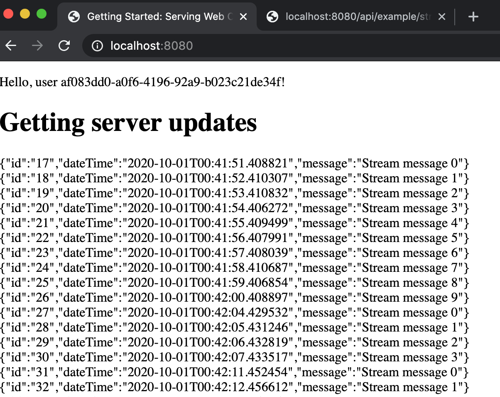

# spring-reactive
Spring reactive how to

This project is based on IntelliJ tutorial's.

Link to [Reactive Manifesto](https://www.reactivemanifesto.org/en)

# How to run

## reactive-server

Run the class ReactiveApplication. 
This class will start the server on default port 8080. If you want to change please change it on application.properties file of this project
<b>application.properties</b>

``server.port=8080`` to other value ``server.port=2020`` 

When the server starts, the 2 apis will be available.
* 1st - /api/bingo
    * Methods
        * /random/{name} - Bingo name of path variable
* 2nd - /api/example
    * Methods
        * /stream - Retrieve data in stream format - Flux
        * /stream/error - A method to try an error on back-end - Flux
        * /stream/{id} - Retrieve by the entity id or empty - Mono
        * /all - Retrieve all data available - Flux
        

Also, calling the url http://localhost:8080 a page will render the data coming from api /api/example/stream

Html code

```javascript
<script>
  if(typeof(EventSource) !== "undefined") {
    var source = new EventSource("http://localhost:8080/api/example/stream");
    source.onmessage = function(event) {
      document.getElementById("exampleOfStream").innerHTML += event.data + "<br>";
    };
  } else {
    document.getElementById("result").innerHTML = "Sorry, your browser does not support server-sent events...";
  }
<script>
```



